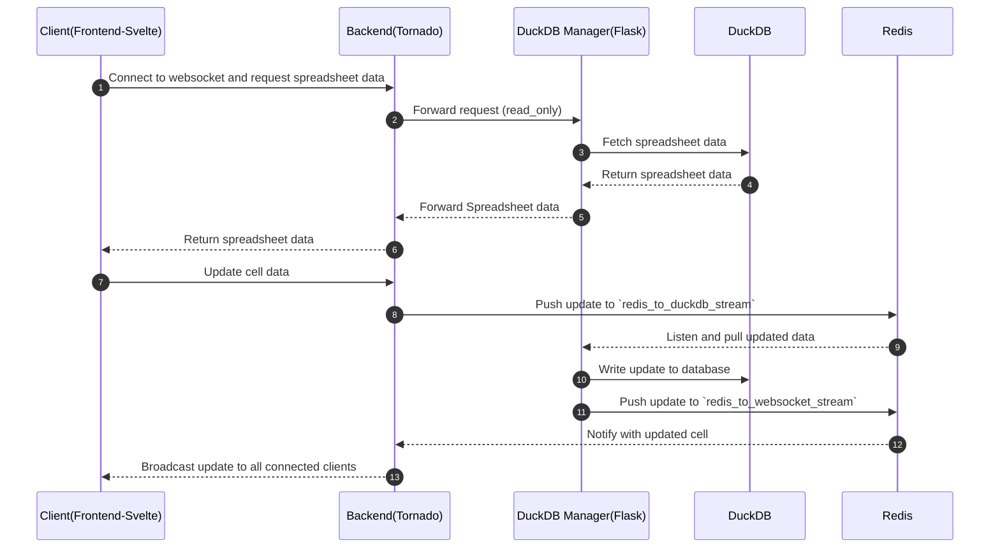

# Reactive Spreadsheet Application

A real-time, distributed, collaborative spreadsheet application built with Python, DuckDB, Redis, Tornado, and Svelte. This project demonstrates real-time updates, persistent data storage, and a reactive UI—all deployed locally and containerized with Docker.

## Table of Contents

- [Introduction](#introduction)
- [Features](#features)
- [Architecture](#architecture)
- [Setup and Installation](#setup-and-installation)
  - [Backend Setup](#backend-setup)
  - [Frontend Setup](#frontend-setup)
  - [Docker Setup](#docker-setup)
- [Usage](#usage)

## Introduction

Reactive Spreadsheet is designed to allow multiple users to collaborate on a single spreadsheet in real-time. The application leverages:

- **Python/Tornado:** For a lightweight WebSocket server to handle real-time connections.
- **DuckDB:** As an embedded SQL database for efficient data storage and querying.
- **Redis Streams:** To manage and broadcast real-time cell updates among connected clients.
- **Svelte:** For building a reactive and user-friendly frontend.
- **AWS:** For deploying and managing the application infrastructure.

## Features

- **Real-Time Collaboration:** Multiple users can view and edit the same spreadsheet concurrently.
- **Live Updates:** Cell updates are broadcast immediately to all connected clients.
- **Data Persistence:** All cell data is stored persistently in DuckDB.
- **Redis Integration:** Updates are published to Redis Streams to decouple and manage real-time messaging.
- **Containerized Deployment:** Both backend and frontend can run in Docker containers orchestrated by Docker Compose.
- **Scalable Architecture:** Built with modular components for future enhancements such as conflict resolution and advanced user management.

## Architecture

Current system design of the application (soon to be deprecated):

New System Design (soon to be implemented):

## Setup and Installation

### Backend Setup without Docker

1. **Clone the Repository:**  
    git clone https://github.com/Nikki-Chig/LiquidDuck.git  
    cd LiquidDuck  

2. **Set Up Python Virtual Environment:**  
    python -m venv venv_reactive_spreadsheet  
    source venv_reactive_spreadsheet/bin/activate   # On Windows: venv_reactive_spreadsheet\Scripts\activate  

3. **Install Dependencies:**  
    pip install -r requirements.txt  

4. **Configuration:**  
    Ensure that you have installed Redis and Redis server is accessible at the correct host. When running locally, the application defaults to connecting to Redis at localhost:6379. 

5. **Run the backend:**  
    To run the backend:  
    python src/server.py  

### Front Setup without Docker
1. **Navigate to the Frontend Directory:**  
    cd frontend  

2. **Install Node Dependencies:**  
    npm install  

3. **Run the Development Server:**  
    npm run dev  

4. **Run the Development Server:**  
    npm run dev  
    The frontend will run at http://localhost:5173.  

### Entire Project Setup with Docker
The project is containerized using Docker Compose.  

1. **Ensure Docker is Installed:**  
    Download and install Docker Desktop.  

2. **Build and Run Containers:**  
    From the project root (reactive_spreadsheet), run:  
        docker compose build  
        docker compose up  

    This starts: 
    Backend Container: Accessible at http://localhost:8888.  
    Frontend Container: Available at http://localhost:5173.  
    Redis Container: Running on port 6379.  

3. **Environment Variables:**  
The backend container uses the environment variable REDIS_HOST=redis (set in docker-compose.yml) to connect to the Redis container.

## Usage
- **Real-Time Editing:**  
    - Open the frontend URL in multiple browser tabs. Edit a cell (double-click to edit) and observe real-time updates across all sessions.

- **Monitoring:**  
    - Check the backend logs for important events such as connection status, error messages, and update broadcasts.This can be useful for debugging and performance monitoring.

